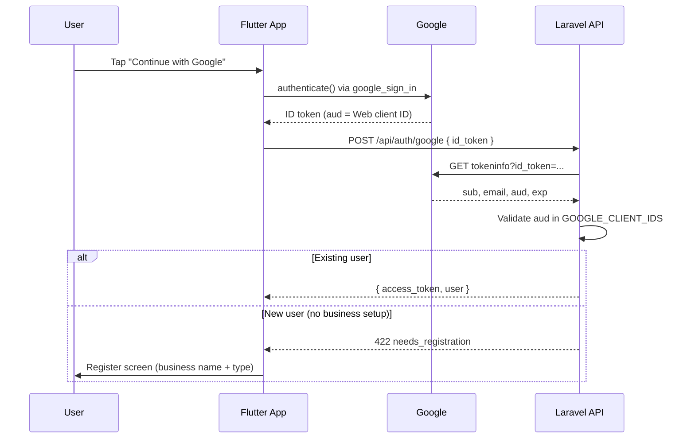

# Google Sign-In Setup — Akira Flow

This app uses **Google Sign-In with ID tokens** (not a browser redirect flow). Flutter gets an ID token from Google; the Laravel API verifies it and returns a Sanctum access token.

---

## How it works



**Code locations**

| Layer | File |
|-------|------|
| Flutter config | `lib/core/google_auth_config.dart` |
| Flutter sign-in | `lib/services/google_auth_service.dart` |
| Flutter API call | `lib/services/auth_service.dart` → `POST /api/auth/google` |
| Laravel endpoint | `services/api/app/Http/Controllers/Api/AuthController.php` |
| Token verification | `services/api/app/Services/GoogleTokenVerifier.php` |
| Env config | `services/api/config/services.php` → `GOOGLE_CLIENT_IDS` |

---

## Step 1 — Google Cloud Console

1. Open [Google Cloud Console](https://console.cloud.google.com/).
2. Create or select a project (e.g. **Akira Flow**).
3. Go to **APIs & Services → OAuth consent screen**.
   - User type: **External** (or Internal if Workspace-only).
   - App name: **Akira Flow**
   - Support email: your email
   - Scopes: default (`email`, `profile`, `openid`) is enough.
   - Add test users while app is in **Testing** mode.
4. Go to **APIs & Services → Credentials → Create credentials → OAuth client ID**.

You need **three** OAuth clients (Web + Android + iOS if you ship iOS).

---

## Step 2 — Create OAuth clients

### A. Web client (required for Android/iOS ID tokens)

1. Application type: **Web application**
2. Name: `Akira Flow Web`
3. Authorized JavaScript origins (optional, for Flutter web):
   - `http://localhost`
   - Your production web URL if any
4. Copy the **Client ID** — looks like:
   ```
   445326255543-xxxxxxxx.apps.googleusercontent.com
   ```

This Web client ID is passed to Flutter as `GOOGLE_WEB_CLIENT_ID`. Android/iOS plugins use it as `serverClientId` so Google returns an ID token the API can verify.

### B. Android client

1. Application type: **Android**
2. Package name: **`app.akirabizhub.pos`** (from `android/app/build.gradle.kts`)
3. SHA-1 certificate fingerprint(s):

**Debug keystore** (local development):

```bash
keytool -list -v \
  -keystore ~/.android/debug.keystore \
  -alias androiddebugkey \
  -storepass android -keypass android
```

Example debug SHA-1 on this machine:

```
09:AD:A7:5C:1C:41:CD:6C:C8:8D:00:34:8D:A5:D8:A1:3D:CC:5B:0B
```

**Release / Play Store upload keystore** (required for production APK/AAB):

```bash
keytool -list -v \
  -keystore /path/to/your/upload-keystore.jks \
  -alias YOUR_ALIAS
```

Also add the **Play App Signing** SHA-1 from Google Play Console → **Setup → App signing** (Google re-signs your app; its SHA-1 must be registered too).

4. Create the Android OAuth client. You do **not** paste the Android client ID into Flutter — only register SHA-1 + package name.

### C. iOS client (if building for iPhone)

1. Application type: **iOS**
2. Bundle ID: **`com.bizhub.samosaTracker`** (from Xcode project)
3. Copy the iOS client ID.
4. Add URL scheme to `ios/Runner/Info.plist`:

```xml
<key>CFBundleURLTypes</key>
<array>
  <dict>
    <key>CFBundleTypeRole</key>
    <string>Editor</string>
    <key>CFBundleURLSchemes</key>
    <array>
      <!-- Reversed iOS client ID, e.g. com.googleusercontent.apps.123456789-abcdef -->
      <string>com.googleusercontent.apps.YOUR_IOS_CLIENT_ID_PREFIX</string>
    </array>
  </dict>
</array>
```

---

## Step 3 — Laravel API environment

Set on **Render** (Web Service → Environment) or local `services/api/.env`:

```env
GOOGLE_CLIENT_IDS=YOUR_WEB_CLIENT_ID.apps.googleusercontent.com
```

Multiple clients (if token `aud` differs by platform):

```env
GOOGLE_CLIENT_IDS=web-id.apps.googleusercontent.com,android-id.apps.googleusercontent.com,ios-id.apps.googleusercontent.com
```

At minimum, include the **Web client ID** — that is what Flutter sends as the ID token audience on Android.

**Render checklist**

| Variable | Example |
|----------|---------|
| `GOOGLE_CLIENT_IDS` | `445326255543-m8hh5al6s529h1c97h4v1ueif4e0hdgd.apps.googleusercontent.com` |
| `APP_KEY` | `base64:...` (required for encryption) |
| `RUN_MIGRATIONS` | `true` (creates `users.google_id` column) |

Verify migration ran:

```bash
php artisan migrate:status
# Should include: 2026_07_13_120000_add_google_id_to_users_table
```

---

## Step 4 — Flutter build flags

### Local development

```bash
flutter run \
  --dart-define=API_BASE_URL=https://akira-flow-api.onrender.com \
  --dart-define=GOOGLE_WEB_CLIENT_ID=YOUR_WEB_CLIENT_ID.apps.googleusercontent.com
```

If `GOOGLE_WEB_CLIENT_ID` is omitted, the app falls back to the default in `lib/core/google_auth_config.dart` (must match your Google Cloud project).

### Google Play release (AAB)

```bash
flutter build appbundle --release \
  --dart-define=API_BASE_URL=https://akira-flow-api.onrender.com \
  --dart-define=GOOGLE_WEB_CLIENT_ID=YOUR_WEB_CLIENT_ID.apps.googleusercontent.com
```

### Flutter web (optional)

Update `web/index.html`:

```html
<meta name="google-signin-client_id" content="YOUR_WEB_CLIENT_ID.apps.googleusercontent.com">
```

---

## Step 5 — Test the flows

### Existing user

1. Open app → **Login**
2. Tap **Continue with Google**
3. Pick Google account
4. Should land on Dashboard with cloud icon

### New user

1. Tap **Continue with Google** on Login
2. API returns `422` with `needs_registration`
3. App opens **Register** with name/email prefilled
4. Enter **business name** and **business category**
5. Tap **Continue with Google** again on Register
6. Account + business created → signed in

### Email user linking Google

If a user registered with email/password first, signing in with the same Google email links `google_id` to the existing account.

---

## Troubleshooting

| Symptom | Likely cause | Fix |
|---------|--------------|-----|
| `PlatformException(sign_in_failed, ...)` code **10** | Android SHA-1 not registered | Add debug + release + Play App Signing SHA-1 in Google Cloud |
| `Google token audience is not allowed` | `GOOGLE_CLIENT_IDS` missing/wrong on API | Set env on Render; redeploy |
| `Invalid or expired Google sign-in token` | Clock skew, revoked session | Sign out and retry |
| Button works but 422 every time | New user skipped business setup | Complete Register screen fields first |
| iOS sign-in fails immediately | Missing URL scheme / iOS OAuth client | Complete Step 2C |
| 500 on `/api/auth/google` | Old API without try/catch | Deploy latest `AuthController` (returns 422 JSON now) |

**Test API directly** (replace token):

```bash
curl -X POST https://akira-flow-api.onrender.com/api/auth/google \
  -H "Content-Type: application/json" \
  -d '{"id_token":"PASTE_ID_TOKEN_HERE"}'
```

---

## Security notes

- Do **not** commit production keystores or `.env` with secrets.
- Prefer `--dart-define=GOOGLE_WEB_CLIENT_ID=...` in CI/CD over hardcoding in source.
- Google `tokeninfo` endpoint works but is legacy; a future upgrade can switch to JWT signature verification with Google's public keys.
- Keep OAuth consent screen in **Testing** until ready for public review, or add all tester emails.

---

## Quick reference

| Item | Value |
|------|-------|
| Android package | `app.akirabizhub.pos` |
| iOS bundle ID | `com.bizhub.samosaTracker` |
| API endpoint | `POST /api/auth/google` |
| Flutter package | `google_sign_in: ^7.2.0` |
| Backend env var | `GOOGLE_CLIENT_IDS` |
| Flutter define | `GOOGLE_WEB_CLIENT_ID` |
